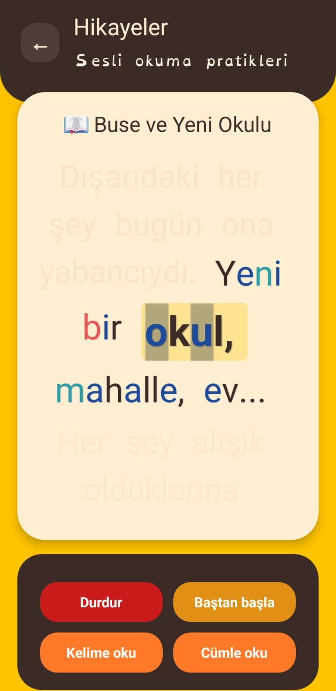
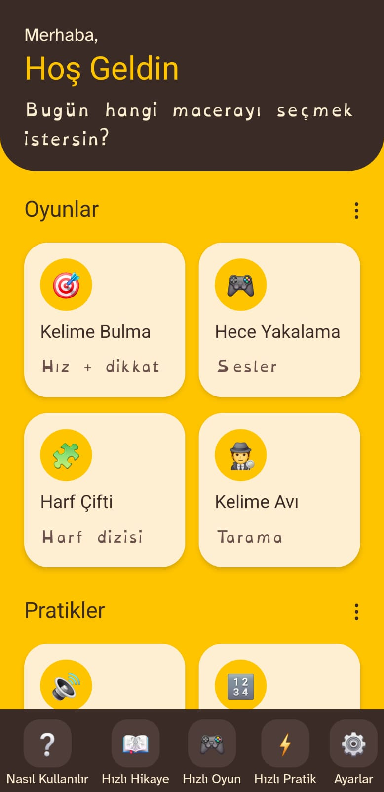
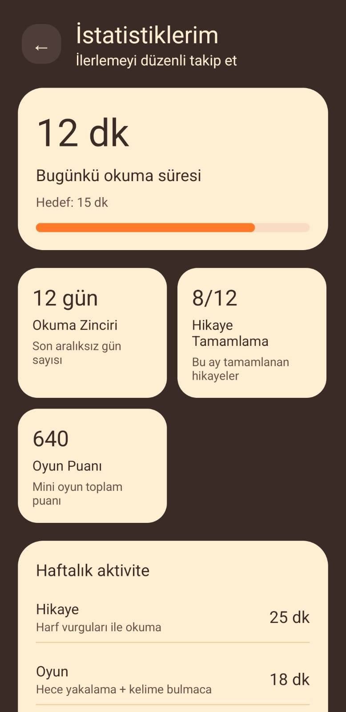

# 🧠📱 Easy Peasy Dyslexia

## AI-Supported Interactive Reading App for Children with Dyslexia (6–12)

> **TÜBİTAK Araştırma Projesi | Açık Kaynak Mobil Uygulama**

**Easy Peasy Dyslexia**, 6–12 yaş arası disleksili (veya disleksi şüphesi bulunan) çocukların  
okuma becerilerini geliştirmek amacıyla geliştirilmiş, **yapay zekâ destekli**,  
**sesli etkileşimli** ve **erişilebilir** bir mobil okuma uygulamasıdır.

Bu proje, disleksili bireyler için **ücretsiz**, **erişilebilir** ve  
**bireyselleştirilmiş** bir öğrenme deneyimi sunmayı hedefler.

---

## 📸 Ekran Görüntüleri

> Aşağıdaki görseller uygulamanın gerçek kullanım arayüzünü göstermektedir.

### 🏠 Ana Ekran
<p align="center">
  
  
</p>

### 📖 Sesli Etkileşimli Hikâye Okuma
<p align="center">
  
</p>

### 🎮 Oyun ve Pratik Modülleri
<p align="center">
  
</p>

### 📊 İstatistik ve Hata Analizi
<p align="center">
  
</p>

---

## 🎯 Projenin Amacı

- Disleksili öğrencilerin **harf karıştırma** ve **okuma hatalarını** azaltmak  
- **Okuma hızı**, **akıcılık** ve **okuma motivasyonunu** artırmak  
- Öğretmen veya veli müdahalesi olmadan **anlık geri bildirim** sunmak  
- Yapay zekâ destekli **kişiselleştirilmiş alıştırmalar** üretmek  
- Eğitimde **fırsat eşitliğini** desteklemek  

---

## ✨ Öne Çıkan Özellikler

### 🔊 Sesli Etkileşimli Okuma
- Cihaz içi **Speech-to-Text (STT)** ile okuma analizi  
- **Levenshtein Mesafe Algoritması** ile hata tespiti  
- Harf, hece ve kelime bazlı değerlendirme  

### 🤖 Yapay Zekâ Destekli Kişiselleştirme
- Öğrencinin hata örüntülerine göre içerik üretimi  
- En sık karıştırılan harf ve seslere özel alıştırmalar  
- **Gemini-2.0-Flash** modeli pedagojik yorumlayıcı olarak kullanılır  

### 🎮 Oyunlaştırılmış Öğrenme
- Hece Oyunu  
- Harf Çifti Eşleştirme  
- Ses Avı  
- Kelime Bulmaca  

### 📖 Hikâye Okuma Modu
- Gölgeli okuma (shadow reading)  
- Renklendirilmiş ve vurgulu harfler  
- Doğru okuma → ilerleme, yanlış okuma → tekrar  

### 📊 İlerleme & İstatistik
- Puan ve seviye sistemi  
- Öğrenciye özel gelişim takibi  
- Tüm veriler **cihaz üzerinde** saklanır  

---

## 🛠️ Kullanılan Teknolojiler

- **React Native**
- **TypeScript**
- **React Navigation**
- **react-native-voicekit** (Offline STT)
- **react-native-tts**
- **AsyncStorage**
- **Gemini-2.0-Flash**
- **Levenshtein Distance Algorithm**

---

## 🧠 Sistem Mimarisi (Özet)

1. Öğrenci sesli okuma başlatır  
2. STT ile ses → metin dönüşümü yapılır  
3. Güven skoru filtresi uygulanır  
4. Levenshtein algoritması ile hata analizi yapılır  
5. İsteğe bağlı olarak yapay zekâ analiz katmanı çalışır  
6. Kişiselleştirilmiş alıştırmalar oluşturulur  

---

## 🔐 Gizlilik ve KVKK

- **Hiçbir kişisel veri toplanmaz**
- Tüm analizler **anonimdir**
- Veriler yalnızca **kullanıcının cihazında** tutulur
- KVKK ve etik ilkelere tam uyumludur

---

## 📱 Platform Desteği

| Platform | Durum |
|--------|------|
| Android | ✅ Destekleniyor (API 24+) |
| iOS | 🚧 Planlanıyor |

- Minimum Android sürümü: **7.0**
- Uygulama boyutu: **~56 MB**
- Temel modüller **offline** çalışır

---

## 🚀 Kurulum

### Gereksinimler
- Node.js (>= 18)
- npm veya yarn
- Expo CLI
- Android Studio (Android için)

### Kurulum Adımları

```bash
git clone https://github.com/kullanici-adi/easy-peasy-dyslexia.git
cd easy-peasy-dyslexia
npm install
npx expo start
